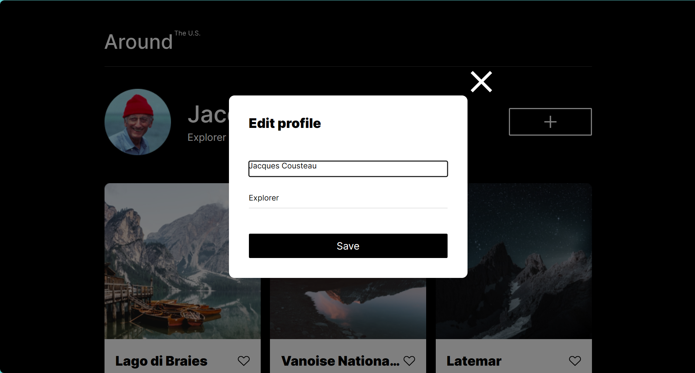
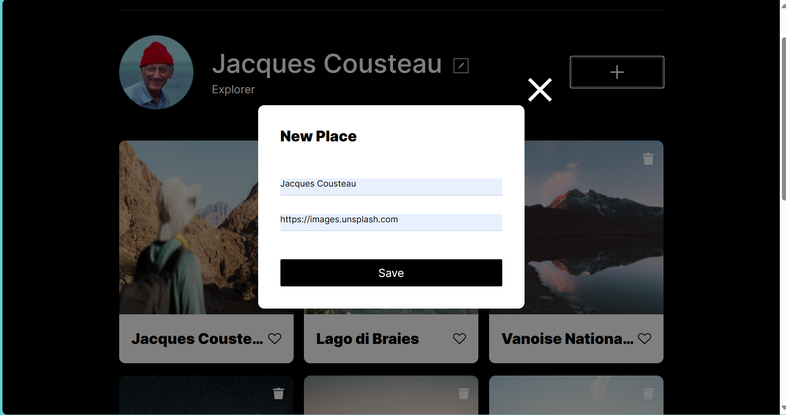
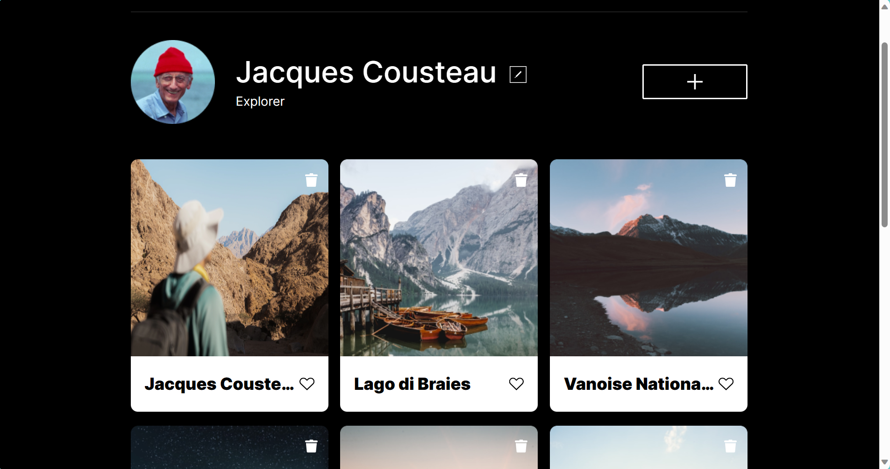
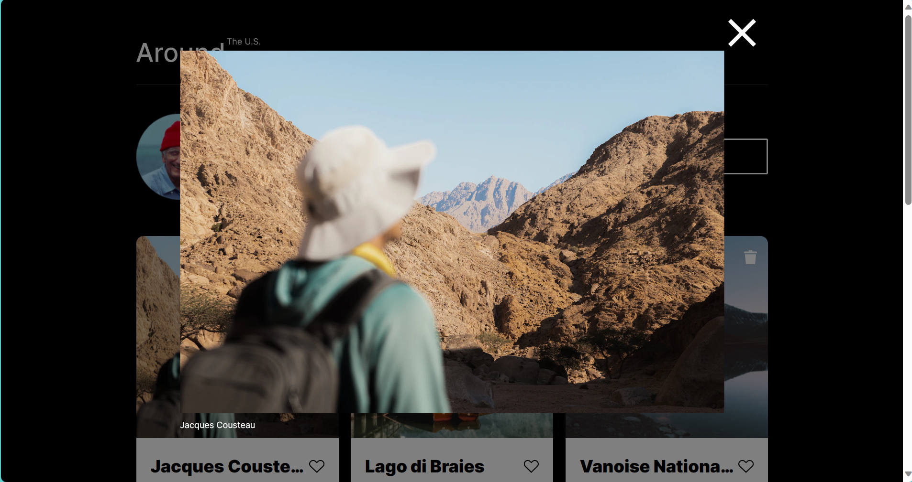

# Around The U.S.

Interactive page where users can add photos and remove them as well.
It also has a profile for the users.

## Project features

- Semantic HTML5
- Flexbox
- Grid
- Responsive Design
- Multiple Break Points
- Interactive Modals

## Screenshots

- 
- 
- 
- 
- 
- 
- 
- 

## Link to Deployed Landing Page

- https://is-go.github.io/se_project_aroundtheus/

## Plan on improving the site

- Add functionality and forms
- Improve on responsive design
- Add more Breakpoints
